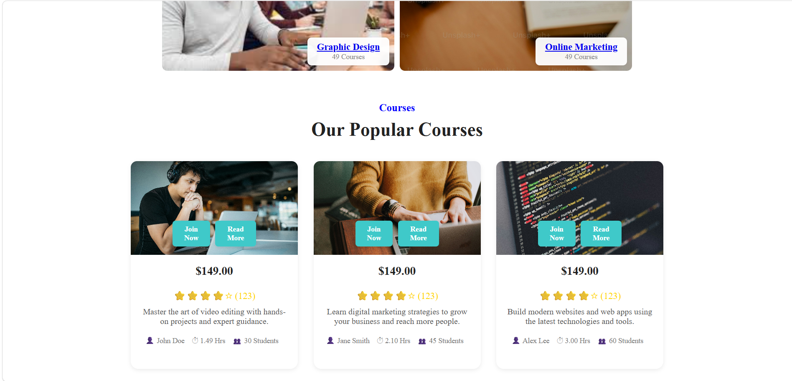
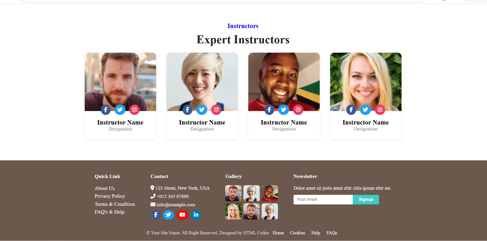
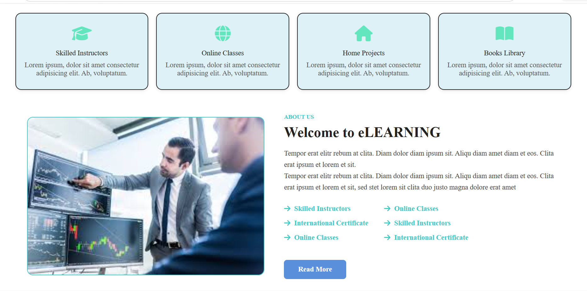

<h1 align="center">🎓 Online Learning Platform</h1>

<p align="center">
  <b>A Modern & Responsive Educational Website Built with HTML5 & CSS3</b>
</p>

<p align="center">


</p>

---

# 🌟 Overview

The **Online Learning Platform** is a modern educational website developed using **HTML5** and **CSS3**.

It provides a clean, attractive and responsive interface where users can explore courses, instructors and educational content with an excellent user experience.

---

# ✨ Features

- 🎯 Modern Responsive Design
- 🏠 Attractive Hero Section
- 📚 Popular Courses Section
- 👨‍🏫 Expert Instructor Cards
- 🖼 Beautiful Image Gallery
- 💌 Newsletter Section
- 📱 Mobile Friendly Layout
- 🎨 Smooth Hover Animations
- 🌐 Font Awesome Icons
- 📞 Contact & Footer Section

---

# 🛠 Tech Stack

| Technology | Description |
|------------|-------------|
| 🧡 HTML5 | Website Structure |
| 💙 CSS3 | Styling & Responsive Design |
| ⭐ Font Awesome | Icons |
| 🎨 CSS Animation | Hover Effects |

---

# 📂 Folder Structure

```text
Online-Learning-Platform
│
├── CSS
│   ├── CSS_project.html
│   ├── home_page.png
│   ├── courses_page.png
│   ├── instructor_page.png
│   └── Responsive_page.png
│
├── HTML
│
├── JS
│
└── README.md
```

---

# 📸 Project Preview

<h2 align="center">🏠 Home Page</h2>

<p align="center">

</p>

---

<h2 align="center">📚 Courses Page</h2>

<p align="center">

</p>

---

<h2 align="center">👨‍🏫 Instructor Page</h2>

<p align="center">

</p>

---

<h2 align="center">📱 Responsive Design</h2>

<p align="center">

</p>

---

# 🚀 Getting Started

## Clone Repository

```bash
git clone https://github.com/Prajwal201204/Online-Learning-Platform.git
```

## Open Project

```bash
Open the project folder

Run the HTML file in your browser
```

---

# 🎯 Future Improvements

- 🔐 Login & Registration
- 👨‍🎓 Student Dashboard
- 💳 Payment Gateway
- 🗄 Database Integration
- 📜 Course Certificates
- 🌙 Dark Mode
- 🔍 Search Functionality
- 🎥 Video Lessons
- 📊 Admin Dashboard

---

# 🤝 Contributing

Contributions are always welcome.

1️⃣ Fork the repository

2️⃣ Create your feature branch

```bash
git checkout -b feature-name
```

3️⃣ Commit your changes

```bash
git commit -m "Added New Feature"
```

4️⃣ Push to GitHub

```bash
git push origin feature-name
```

5️⃣ Create a Pull Request

---

# 💻 Author

## 👨‍💻 Prajwal Nevase

🎓 MCA Student

🌐 Frontend Developer

🐍 Python Developer

💙 Passionate about Web Development

### Connect with Me

<p align="center">

<a href="https://github.com/Prajwal201204" target="_blank">
  
</a>

<a href="https://www.linkedin.com/in/prajwal-nevase-b47585341/" target="_blank">
  
</a>

</p>

---

# ⭐ Support

If you like this project,

⭐ Star this repository

🍴 Fork this repository

📢 Share it with others

---

<h2 align="center">Thank You ❤️</h2>

<p align="center">


</p>

<p align="center">
Made with ❤️ by <b>Prajwal Nevase</b>
</p>
